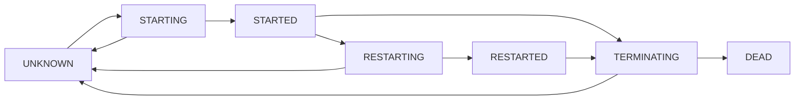

# Kernel Lifecycle State Management

The `jupyter_client.lifecycle` module provides a state machine implementation for tracking kernel lifecycle states across different kernel management operations. This feature is designed to help developers build more robust kernel management systems with better observability and error handling.

## Quick Start

To add lifecycle state tracking to a kernel manager, simply inherit from `KernelManagerStateMixin`:

```python
from jupyter_client.lifecycle import KernelManagerStateMixin
from jupyter_client.manager import KernelManager

class StatefulKernelManager(KernelManagerStateMixin, KernelManager):
    pass

# The mixin automatically tracks state during kernel operations
manager = StatefulKernelManager()
print(manager.lifecycle_state)  # "unknown"

await manager.start_kernel()
print(manager.lifecycle_state)  # "started"
print(manager.is_started)       # True
```

## Core Components

### LifecycleState Enum

The `LifecycleState` enum defines the possible states a kernel can be in:

- **UNKNOWN**: Initial state or state after errors
- **STARTING**: Kernel is in the process of starting
- **STARTED**: Kernel has been started successfully
- **RESTARTING**: Kernel is in the process of restarting
- **RESTARTED**: Kernel has been restarted successfully
- **TERMINATING**: Kernel is in the process of shutting down
- **DEAD**: Kernel has been shut down

The enum inherits from `str` for convenient usage:

```python
from jupyter_client.lifecycle import LifecycleState

# Direct string comparison works
assert LifecycleState.UNKNOWN == "unknown"
assert "started" == LifecycleState.STARTED

# No need for .value attribute
state = LifecycleState.STARTED
print(state)  # "started"
```

### KernelManagerStateMixin

The `KernelManagerStateMixin` class provides automatic state tracking for kernel managers. It uses the `__init_subclass__` hook to automatically wrap kernel management methods with state transition decorators.

Key features:
- Automatic method wrapping for `start_kernel`, `restart_kernel`, and `shutdown_kernel`
- Support for both synchronous and asynchronous methods
- Automatic error handling (failed operations reset state to UNKNOWN)
- Configurable `lifecycle_state` trait
- Convenient state checking properties

```python
class MyKernelManager(KernelManagerStateMixin, SomeBaseManager):
    def start_kernel(self):
        # Your start logic here
        pass

manager = MyKernelManager()

# State checking properties
print(manager.is_unknown)     # True
print(manager.is_started)     # False

manager.start_kernel()
print(manager.is_started)     # True
```

### state_transition Decorator

For custom state management scenarios, you can use the `state_transition` decorator directly:

```python
from jupyter_client.lifecycle import state_transition, LifecycleState

class CustomManager:
    lifecycle_state = LifecycleState.UNKNOWN

    @state_transition(LifecycleState.STARTING, LifecycleState.STARTED)
    def custom_start(self):
        # Custom start logic
        return "started"

    @state_transition(LifecycleState.TERMINATING, LifecycleState.DEAD)
    async def custom_shutdown(self):
        # Custom async shutdown logic
        return "shutdown complete"
```

## State Transitions

The state machine handles these automatic transitions:

1. **start_kernel**: `unknown` → `starting` → `started` (or `unknown` on failure)
2. **restart_kernel**: `*` → `restarting` → `restarted` (or `unknown` on failure)
3. **shutdown_kernel**: `*` → `terminating` → `dead` (or `unknown` on failure)



## Advanced Usage

### Custom Kernel Managers

You can use the mixin with any kernel manager that follows standard method naming conventions:

```python
class CustomKernelManager(KernelManagerStateMixin):
    def __init__(self):
        super().__init__()
        self.kernel_id = "custom-kernel"
        self.log = logging.getLogger(__name__)

    def start_kernel(self, **kwargs):
        # Custom start logic
        return {"kernel_id": self.kernel_id}

    async def restart_kernel(self, **kwargs):
        # Custom async restart logic
        await asyncio.sleep(1)  # Simulate restart time
        return {"kernel_id": self.kernel_id}

    def shutdown_kernel(self, immediate=False, **kwargs):
        # Custom shutdown logic
        return True
```

### Manual State Management

While automatic state management is the primary use case, you can also manually control states:

```python
manager = MyKernelManager()

# Manual state setting
manager.set_lifecycle_state(LifecycleState.STARTED)
assert manager.is_started

# Direct assignment
manager.lifecycle_state = LifecycleState.DEAD
assert manager.is_dead
```

### Error Handling and Recovery

Failed operations automatically reset the state to `UNKNOWN`:

```python
class FailingKernelManager(KernelManagerStateMixin):
    def start_kernel(self):
        raise RuntimeError("Start failed")

manager = FailingKernelManager()
try:
    manager.start_kernel()
except RuntimeError:
    pass

print(manager.lifecycle_state)  # "unknown"

# You can implement retry logic based on state
if manager.is_unknown:
    # Retry or handle the error
    pass
```

## Best Practices

1. **Use state checking properties**: Prefer `manager.is_started` over `manager.lifecycle_state == "started"`
2. **Handle UNKNOWN states**: Always have logic to handle when state is UNKNOWN after failures
3. **Test state transitions**: Include state assertions in your kernel manager tests
4. **Don't override mixin methods**: Avoid overriding the state checking properties or internal methods